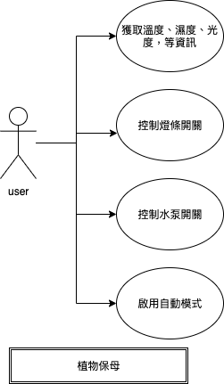

## This is the FYP of mine and by group mates
Product of 2019
### What to do 

It used to control the sensors, pump and led so that we can keep the plant using command or webUI

### FlowChart

Credit:

      Arduino Code 			- Me
      Python3 Code(pySerial Part) 	- Me 
      Python3 Code(Flask Part)  	- Teammate A 
      Pi system setting up 		- Me
      run.sh 			- Me
      Eating popcorn & do nothing - Teammate B, C, D
HTML not included in this github, because it's not by me.
